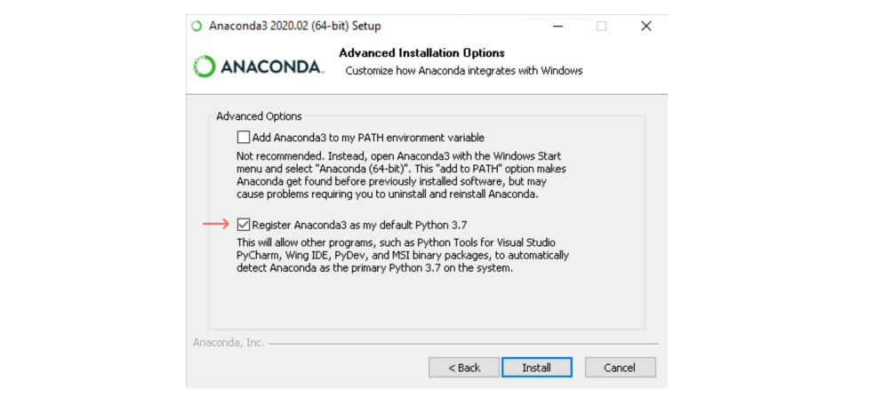
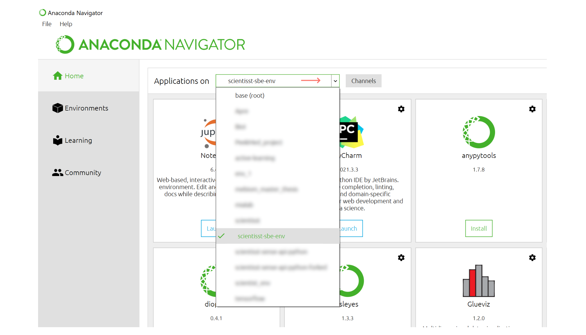

# Introduction to Biosignal Acquisition 

[](https://scientisst.github.io/scientisst-sense-api-python/) 


Hi! Before attending this workshop, we would like to make sure you have **python installed** in your computer with the required software up and running. Please, **don't forget to bring your laptop** on the 1st of April.

First, check if you have **Anaconda Navigator** and **Anaconda Prompt**. If you don't have Anaconda, go to part 1 below. Otherwise, open Anaconda Prompt and type:
```batch
python --version
```
If you get:
```batch
Python 3.X.X
```
Skip to part 2

## 1. Anaconda Installation

1. Go to https://www.anaconda.com/products/individual and **download the Individual (open source) package** for your OS system (windows, Mac or Linux)

2. Select your installation folder, hit next and for Advanced Options select **Register Anaconda3 as my default Python 3.X**
<br/><br/>



## 2. Create a Conda Environment

1. First things first, you need to create or choose an existing folder where you'll store the software. I chose this one:
```batch
C:\Users\ScientISST\SBE
```

2. Then, open Anaconda Prompt and create a virtual environment:
```batch
conda create --name scientisst-sbe-env
```


(**don't close the terminal yet**)

## 3. Installing ScientISST Sense API and Biosppy

3. Activate your conda environment by running:
```batch
conda activate scientisst-sbe-env
```

4. To download the required packages, you need to install pip by running:
```batch
conda install pip
```

5. To download our respository, you need to install Git:
```batch
conda install git
```

6. Now we can add the python packages that we'll need:
```batch
conda install numpy==1.16.5
```
```batch
conda install pandas
```
```batch
pip install pyserial
```
```batch
pip install biosppy
```

7. Remember that folder we created before? We need it to install the ScientISST Sense API. Run:
```batch
git clone https://github.com/scientisst/scientisst-sense-api-python.git <path to your folder>
```

So, in my case I run:

```batch
git clone https://github.com/scientisst/scientisst-sense-api-python.git "C:\Users\ScientISST\SBE"
```


## 4. Opening the jupyter notebook

1. Close the Anaconda Prompt (and the Anaconda Navigator).

2. Reopen the Anaconda Navigator and on the top bar, select your environment:

<br/><br/>




3. Once inside the environment, scroll to the Jupyter Notebook, install it and launch it!

## 4. Checking the setup

Let's check if everything's working!

In the Jupyter Notebook (web browser), navigate to your folder and add a new python file inside. 
Run the following:

```{python}
from biosppy import storage
from biosppy.signals import ecg

signal, mdata = storage.load_txt('./examples/ecg.txt')
```


This should output the error:

```diff
- FileNotFoundError: [Errno 2] No such file or directory: (...)
```


Now run the following:

```{python}
%run sense.py
```

This should say:

```diff
- error: No paired device found
```

Don't worry, it just means we have no files and devices nearby right now. See you in the workshop!
